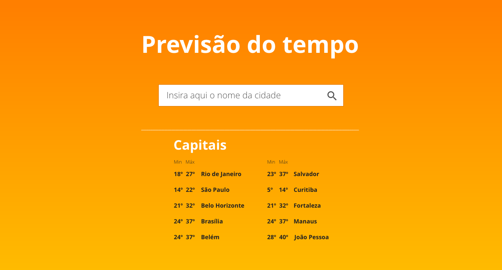

# Desafio Front-End

O desafio consiste em criar uma página simples que nos mostre a previsão do tempo.

Você deve fazer todos os commits do código fonte diretamente neste repositório ao longo da sua evolução para que possamos acompanhar, ou seja, evite commitar toda a solução de uma única vez.

Forneça todas as instruções necessárias para executarmos sua solução e não deixe de justificar quaisquer decisões tomadas em `/COMMENTS.md`.

Dicas:

- Você pode usar ferramentas e bibliotecas open source, mas documente as decisões justificando suas escolhas;
- Automatize o máximo possível;
- Se tiver dúvidas, pergunte.

## Considerações gerais

Esse problema tem 2 constraints:

A) Eu preciso conseguir rodar seu código em um Mac OS X ou Ubuntu;

B) Eu executarei seu código com os seguintes comandos ou algo similar (dê-me as instruções):

```bash
  git clone seu-fork
  cd seu-fork
  ./configure
  make
```

Esses comandos tem que ser o suficiente para configurar meu Mac OS X/Ubuntu e executar seu programa.

Pode considerar que eu tenho instalado no meu sistema o Node.js. Qualquer outra dependência que eu precisar você deve fornecer.

## Escopo

O objetivo é criarmos uma página simples que consuma a API do Yahoo! (https://developer.yahoo.com/weather/) e nos permita pesquisar por uma cidade para obter sua previsão do tempo.

A interface implementada deverá ficar o mais próximo possível das telas aqui presentes, incluindo a versão responsiva para dispositivos móveis. Os avaliadores são exigentes!

### Requisitos

- Framework React.js
- Usar algum pré-processador de CSS (sugerimos SASS)

### Dicas

- Use o Axios para comunicação com a API
- HTML o mais semântico possível
- Use uma boa convenção para os identificadores CSS
- Comprima seus recursos após o build
- Escreva testes

## Telas Desktop




## Telas Mobile


## O que será avaliado na sua solução?

Queremos ver tudo o que você conhece sobre desenvolvimento front-end. Alguns dos aspectos que serão observados nesse desafio são:

* clareza/objetividade/simplicidade
* estilo do código
* documentação
* testes
* automação
* diferenciais implementados

Boa sorte! :v:

---

Créditos: Construído a partir do desafio da [1STi](https://github.com/1STi/desafio-frontend/).
